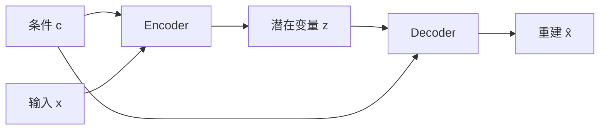

# CVAE (Conditional Variational AutoEncoder)

## 背景：从 VAE 到 CVAE

### VAE 的局限性

VAE (Variational AutoEncoder) 是一种**无条件生成模型**：
- 输入：随机噪声 $z \sim \mathcal{N}(0, 1)$
- 输出：生成的样本 $x$

**问题**：无法控制生成的内容，完全随机。

### CVAE 的核心思想

CVAE (Conditional VAE) 通过**引入条件信息**来实现可控生成：
- 输入：条件 $c$ + 随机噪声 $z$
- 输出：基于条件 $c$ 生成的样本 $x$

$$p_\theta(x|c) = \int p_\theta(x|z,c)p(z)dz$$

---

## 模型结构

### VAE vs CVAE

```
VAE:
  Encoder: x → q_ϕ(z|x)
  Decoder: z → p_θ(x)

CVAE:
  Encoder: (x, c) → q_ϕ(z|x,c)
  Decoder: (z, c) → p_θ(x|c)
```

### 网络架构



---

## 数学推导

### VAE 的 ELBO (Evidence Lower Bound)

VAE 最大化以下目标：

$$\mathcal{L}_{VAE} = \mathbb{E}_{q_\phi(z|x)}[\log p_\theta(x|z)] - D_{KL}(q_\phi(z|x) || p(z))$$

### CVAE 的 ELBO

将条件 $c$ 加入每一项：

$$\mathcal{L}_{CVAE} = \mathbb{E}_{q_\phi(z|x,c)}[\log p_\theta(x|z,c)] - D_{KL}(q_\phi(z|x,c) || p(z|c))$$

通常假设 $p(z|c) = p(z) = \mathcal{N}(0, I)$，即先验与条件无关。

### 重参数化技巧 (Reparameterization Trick)

为了能够反向传播，使用重参数化：

$$z = \mu_\phi(x,c) + \sigma_\phi(x,c) \odot \epsilon, \quad \epsilon \sim \mathcal{N}(0, I)$$

---

## 训练算法

### CVAE 训练流程

```
1. Sample (x, c) from training data
2. Encode: (μ, σ) = Encoder(x, c)
3. Reparameterize: z = μ + σ ⊙ ε, ε ~ N(0,I)
4. Decode: x̂ = Decoder(z, c)
5. Compute loss:
   - Reconstruction loss: ||x - x̂||²
   - KL divergence: -log(σ) + 0.5(μ² + σ² - 1)
6. Backprop and update
```

### 损失函数

$$\mathcal{L} = \underbrace{||x - \hat{x}||^2}_{\text{Reconstruction}} + \underbrace{\beta \cdot D_{KL}(q_\phi(z|x,c) || p(z))}_{\text{Regularization}}$$

---

## CVAE 的应用

### 1. 条件图像生成

给定类别标签生成对应图像：
- 条件 $c$：类别标签（如"猫"、"狗"）
- 输出 $x$：对应类别的图像

### 2. 对话生成

给定上下文生成回复：
- 条件 $c$：上文句子
- 输出 $x$：回复句子

### 3. 图像修复 (Inpainting)

给定部分图像修复完整图像：
- 条件 $c$：不完整的图像
- 输出 $x$：完整的图像

### 4. 超分辨率

给定低分辨率图像生成高分辨率图像：
- 条件 $c$：低分辨率图像
- 输出 $x$：高分辨率图像

### 5. 多模态生成

给定一种模态生成另一种模态：
- 条件 $c$：文本描述
- 输出 $x$：图像

---

## CVAE vs 其他生成模型

| 模型 | 条件生成 | 采样速度 | 生成质量 | 训练稳定性 |
|------|---------|---------|---------|-----------|
| **CVAE** | ✅ | ✅ 快 | ⚠️ 中等 | ✅ 稳定 |
| **CGAN** | ✅ | ✅ 快 | ✅ 好 | ❌ 不稳定 |
| **Diffusion** | ✅ | ❌ 慢 | ✅✅ 最好 | ✅ 稳定 |

---

## 实践技巧

### 1. β-CVAE

增加 KL 项的权重，学习更解耦的表示：

$$\mathcal{L} = \text{Reconstruction} + \beta \cdot \text{KL}, \quad \beta > 1$$

### 2. 条件编码方式

| 方式 | 说明 | 适用场景 |
|------|------|---------|
| **Concat** | 将 $c$ 与输入拼接 | 通用 |
| **FiLM** | 用 $c$ 生成缩放和平移参数 | 图像生成 |
| **AdaIN** | 条件实例归一化 | 风格迁移 |

### 3. 潜在空间插值

在潜在空间插值可以生成平滑过渡的样本：

$$z_\alpha = \alpha \cdot z_1 + (1-\alpha) \cdot z_2$$

---

## 代码结构示例

```python
class CVAE(nn.Module):
    def __init__(self, latent_dim, condition_dim):
        self.encoder = Encoder(latent_dim, condition_dim)
        self.decoder = Decoder(latent_dim, condition_dim)
    
    def forward(self, x, c):
        mu, logvar = self.encoder(x, c)
        z = self.reparameterize(mu, logvar)
        x_hat = self.decoder(z, c)
        return x_hat, mu, logvar
    
    def sample(self, c, n_samples):
        z = torch.randn(n_samples, self.latent_dim)
        return self.decoder(z, c)
```

---

## 相关链接

- [Common/AutoEncoder.md](../Common/AutoEncoder.md) - 基础 AutoEncoder
- [GAN/VAEGAN.md](../GAN/VAEGAN.md) - VAE 与 GAN 结合
- [GAN/Condition.md](../GAN/Condition.md) - 条件 GAN

---

## 参考资料

1. Sohn, K., Yan, X., & Lee, H. (2015). Learning Structured Output Representation using Deep Conditional Generative Models. *NeurIPS*.
2. Kingma, D. P., & Welling, M. (2014). Auto-Encoding Variational Bayes. *ICLR*.
