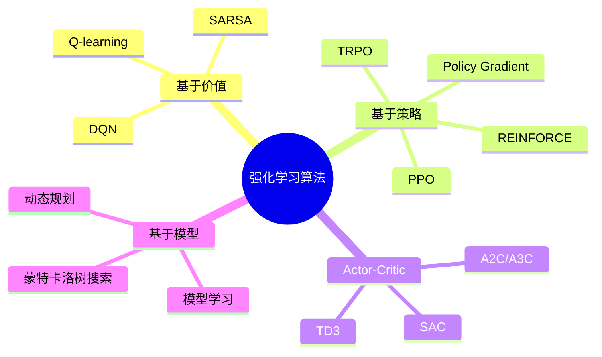

# 强化学习基础

## 核心概念

**强化学习 (Reinforcement Learning, RL)** 是一种通过**与环境交互**来学习最优行为的学习范式。

```
智能体 (Agent)
    │
    │ 观察状态 s_t
    ▼
环境 (Environment) ──→ 执行动作 a_t ──→ 获得奖励 r_t
    │                                       │
    └───────────────────────────────────────┘
                环境状态更新
```

**关键特点**：
- **试错学习**：通过尝试错误来学习
- **延迟奖励**：当前动作可能影响未来的奖励
- **序列决策**：需要考虑长期后果

## 与监督学习的对比

| | **监督学习** | **强化学习** |
|---|------------|------------|
| **数据来源** | 标注数据集 | 与环境交互 |
| **学习目标** | 预测标签/值 | 最大化累积奖励 |
| **反馈形式** | 正确答案 | 奖励信号（标量） |
| **时间依赖** | 通常独立同分布 | 序列依赖 |
| **典型应用** | 图像分类、翻译 | 游戏 AI、机器人控制 |

---

## 马尔可夫决策过程 (MDP)

### MDP 的定义

**马尔可夫决策过程 (Markov Decision Process, MDP)** 是强化学习的数学框架，用于描述序贯决策问题。

一个 MDP 由五元组定义：

$$
\mathcal{M} = (S, A, P, R, \gamma)
$$

| 符号 | 名称 | 说明 |
|------|------|------|
| \\(S\\) | **状态空间** (State Space) | 所有可能状态的集合 |
| \\(A\\) | **动作空间** (Action Space) | 所有可能动作的集合 |
| \\(P\\) | **状态转移概率** | \\(P(s' \mid s, a)\\)：在状态 \\(s\\) 执行动作 \\(a\\) 后转移到 \\(s'\\) 的概率 |
| \\(R\\) | **奖励函数** | \\(R(s, a, s')\\)：状态转移的即时奖励 |
| \\(\gamma\\) | **折扣因子** | \\(\gamma \in [0,1]\\)：未来奖励的折现率 |

### 马尔可夫性质

**马尔可夫性质**：当前状态已知的情况下，下一时刻状态只与当前状态相关，而与历史无关。

$$
P(s _{t+1} \mid s_t, a_t, s _{t-1}, a _{t-1}, \dots) = P(s _{t+1} \mid s_t, a_t)
$$

**直观理解**：当前状态 \\(s_t\\) 包含了做决策所需的**全部信息**。

### 轨迹与回报

**轨迹 (Trajectory)**：一次完整的状态 - 动作序列

$$
\tau = (s_0, a_0, s_1, a_1, s_2, a_2, \dots)
$$

**回报 (Return)**：轨迹的累积折扣奖励

$$
G_t = \sum _{k=0} ^{\infty} \gamma ^k r _{t+k} = r_t + \gamma r _{t+1} + \gamma ^2 r _{t+2} + \dots
$$

**折扣因子的作用**：
- \\(\gamma = 0\\)：只关心眼前利益
- \\(\gamma \to 1\\)：考虑长远利益
- 数学上保证无限时域回报有界

---

## 核心概念

### 策略 (Policy)

**策略** \\(\pi\\) 是智能体的行为准则，定义了在每个状态下如何选择动作。

| 类型 | 数学形式 | 说明 |
|------|---------|------|
| **确定性策略** | \\(a = \pi(s)\\) | 状态 \\(s\\) 下总是选择同一动作 |
| **随机性策略** | \\(\pi(a \mid s)\\) | 状态 \\(s\\) 下选择动作 \\(a\\) 的概率 |

### 价值函数 (Value Function)

**状态价值函数** \\(V^\pi(s)\\)：从状态 \\(s\\) 开始，遵循策略 \\(\pi\\) 的期望回报

$$
V^\pi(s) = \mathbb{E} _\pi\left[G_t \mid s_t = s\right] = \mathbb{E} _\pi\left[\sum _{k=0} ^{\infty} \gamma ^k r _{t+k} \mid s_t = s\right]
$$

**动作价值函数 (Q 函数)** \\(Q^\pi(s, a)\\)：在状态 \\(s\\) 执行动作 \\(a\\) 后，遵循策略 \\(\pi\\) 的期望回报

$$
Q^\pi(s, a) = \mathbb{E} _\pi\left[G_t \mid s_t = s, a_t = a\right]
$$

### 贝尔曼方程 (Bellman Equation)

贝尔曼方程描述了价值函数的**递归结构**：

**状态价值的贝尔曼方程**：

$$
V^\pi(s) = \sum_a \pi(a \mid s) \sum _{s'} P(s' \mid s, a) \left[R(s, a, s') + \gamma V^\pi(s')\right]
$$

**Q 函数的贝尔曼方程**：

$$
Q^\pi(s, a) = \sum _{s'} P(s' \mid s, a) \left[R(s, a, s') + \gamma \sum _{a'} \pi(a' \mid s') Q^\pi(s', a')\right]
$$

### 最优价值函数

**最优状态价值函数**：

$$
V^*(s) = \max_\pi V^\pi(s)
$$

**最优动作价值函数**：

$$
Q^*(s, a) = \max_\pi Q^\pi(s, a)
$$

**贝尔曼最优方程**：

$$
V^*(s) = \max_a \sum _{s'} P(s' \mid s, a) \left[R(s, a, s') + \gamma V^*(s')\right]
$$

$$
Q^*(s, a) = \sum _{s'} P(s' \mid s, a) \left[R(s, a, s') + \gamma \max _{a'} Q^*(s', a')\right]
$$

---

## 强化学习算法分类

### 分类图谱



### 1. 基于价值的方法 (Value-based)

**核心思想**：学习价值函数（Q 函数），通过价值函数导出策略。

$$
\pi(s) = \arg\max_a Q(s, a)
$$

**代表算法**：
- **Q-learning**：离线时序差分学习
- **SARSA**：在线时序差分学习
- **DQN**：深度 Q 网络（用神经网络近似 Q 函数）

**特点**：
- ✅ 样本效率较高
- ✅ 适用于离散动作空间
- ❌ 难以处理连续动作空间

### 2. 基于策略的方法 (Policy-based)

**核心思想**：直接学习并优化策略函数 \\(\pi(a \mid s; \theta)\\)。

$$
\max _\theta J(\theta) = \mathbb{E} _{\tau \sim \pi _\theta}\left[\sum _{t=0} ^T \gamma ^t r_t\right]
$$

**策略梯度定理**：

$$
\nabla _\theta J(\theta) = \mathbb{E} _{\tau \sim \pi _\theta}\left[\sum _{t=0} ^T \nabla _\theta \log \pi _\theta(a_t \mid s_t) Q^\pi(s_t, a_t)\right]
$$

**代表算法**：
- **REINFORCE**：蒙特卡洛策略梯度
- **TRPO**：信赖域策略优化
- **PPO**：近端策略优化

**特点**：
- ✅ 适用于连续动作空间
- ✅ 可学习随机策略
- ❌ 样本效率较低

### 3. Actor-Critic 方法

**核心思想**：结合基于价值和基于策略的方法。

```
Actor (策略网络) ──→ 选择动作 a
       │
       ▼
Critic (价值网络) ──→ 评估动作好坏
```

**更新规则**：
- **Actor**：根据 Critic 的评估更新策略
- **Critic**：学习价值函数

**代表算法**：
- **A2C/A3C**：同步/异步优势 Actor-Critic
- **SAC**：软 Actor-Critic（最大熵 RL）
- **TD3**：双延迟深度确定性策略梯度

**特点**：
- ✅ 样本效率高
- ✅ 适用于连续控制
- ✅ 训练稳定

### 4. 基于模型的方法 (Model-based)

**核心思想**：学习环境的动力学模型，然后基于模型进行规划。

$$
s _{t+1} = f(s_t, a_t; \theta _{model})
$$

**方法分类**：

| 方法 | 说明 |
|------|------|
| **已知模型** | 使用已知的物理模型（如机器人动力学） |
| **学习模型** | 用神经网络学习状态转移函数 |
| **模型学习 + 规划** | 学习模型后用 MPC 等方法规划 |

**代表算法**：
- **MBPO**：基于模型的策略优化
- **MuZero**：学习隐式模型 + 蒙特卡洛树搜索

**特点**：
- ✅ 样本效率最高
- ✅ 可"想象"未来
- ❌ 模型误差影响性能

---

## 关键要点总结

### MDP 基础
- **状态**、**动作**、**转移概率**、**奖励**、**折扣因子**
- **策略** \\(\pi\\)：状态到动作的映射
- **价值函数** \\(V^\pi, Q^\pi\\)：评估状态/动作的好坏
- **贝尔曼方程**：价值函数的递归分解
- **最优价值函数**：\\(V^*, Q^*\\) 满足贝尔曼最优方程

### 算法分类
| 类别 | 代表算法 | 适用场景 |
|------|---------|---------|
| 基于价值 | DQN | 离散控制 |
| 基于策略 | PPO, TRPO | 连续控制 |
| Actor-Critic | SAC, TD3 | 连续控制 + 高效率 |
| 基于模型 | MBPO | 样本效率优先 |

### 与其他章节的关系
- [Policy Based 算法](Policy1.md) - 详细推导策略梯度
- [Value Based 算法](Value1.md) - 详细推导价值函数
- [A3C](A3C2.md) - Actor-Critic 方法详解
